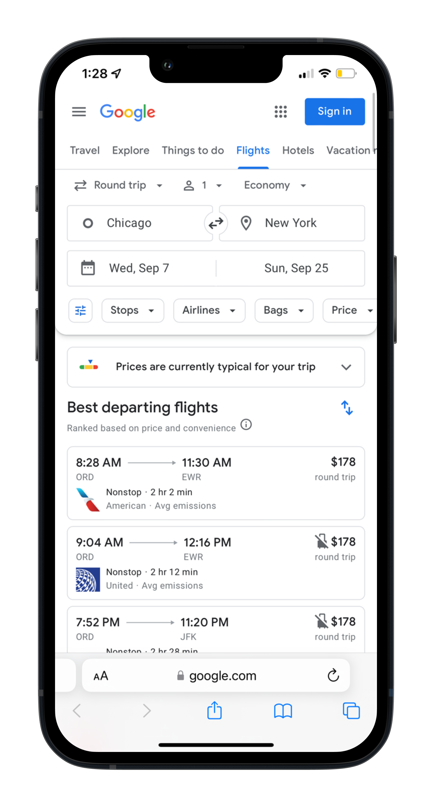

# Flight Tracker SMS Alert app 

---

A flight tracker SMS alert app utilizing the following API's. 
<ul>
<li><b>Twilio API</b> for managing SMS messaging.
</li><li><b>Tequila Travel API</b> for managing flight data queries & requests.</li><li><b>Sheety</b> for converting a Google Sheets document into a Restful JSON API.</li></ul>

The flight tracker app requests airport, destination, and baseline ticket price data from Sheety, and performs a flight search through Tequila API. Tequila API returns the date range and discounted round-trip flight price for the destinations from Sheety. Twilio then sends a SMS to the user containing a notification message and Google link for the user to purchase the flight tickets. 

## SMS Output:
"Low price alert!" 
Only $192 to fly from Chicago-ORD  to New York-NYC, from 2022-09-07 to 2022-09-25.

